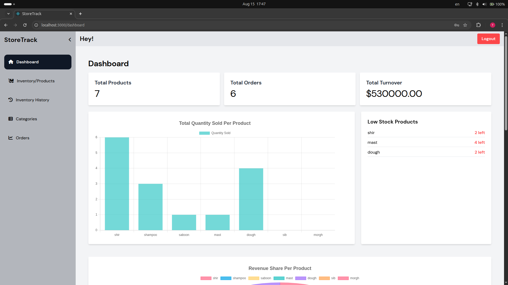

<div align="center">
  <h1 align="center">
    StoreTrack
  </h1>
  <p align="center">
    A comprehensive full-stack MERN inventory management system.
    <br />
    <a href="#-key-features"><strong>Explore the features »</strong></a>
    <br />
    <br />
    <a href="#-getting-started">Getting Started</a>
    ·
    <a href="#-tech-stack">Tech Stack</a>
  </p>
</div>

<div align="center">
  
  
  
  
  
</div>
<br />



## 📖 About The Project

StoreTrack is a complete inventory management solution built with the MERN stack (MongoDB, Express, React, Node.js). It provides a user-friendly interface for businesses to manage products, track orders, and visualize sales data. This application was built to demonstrate a full-stack workflow, from backend API development to a dynamic, responsive frontend.

---

## ✨ Key Features

This application includes a wide range of features to provide a comprehensive inventory management experience:

* **User Authentication:** Secure user registration and login system using JSON Web Tokens (JWT) with password hashing.
* **Persistent Sessions:** Users remain logged in across browser sessions using `localStorage`.
* **Reporting Dashboard:**
    * At-a-glance metrics for total products, orders, and sales turnover.
    * Interactive charts to visualize sales quantity per product and revenue share by product.
    * A real-time list of products with low stock (quantity less than 5).
* **Product Management:** Full CRUD (Create, Read, Update, Delete) functionality for products.
* **Order Management:**
    * Create new orders from a list of available products.
    * **Automated Inventory Reduction:** Creating an order automatically decreases the stock quantity of the included products.
    * Track and update order status (`Pending`, `Sending`, `Complete`, `Canceled`).
* **Category Management:** Organize products by creating and managing categories.
* **Search and Filtering:** Powerful client-side search and filtering on both the Products and Orders pages.
* **Stock Movement History:**
    * A complete audit trail (Inventory Log) of all stock changes.
    * Automatically logs stock **OUT** when an order is created.
    * Automatically logs stock **IN** when a new product is created.

---

## 🛠️ Tech Stack

### Frontend
* [React](https://reactjs.org/)
* [React Router](https://reactrouter.com/)
* [Tailwind CSS](https://tailwindcss.com/)
* [Axios](https://axios-http.com/)
* [Chart.js](https://www.chartjs.org/) & [react-chartjs-2](https://react-chartjs-2.js.org/)

### Backend
* [Node.js](https://nodejs.org/)
* [Express](https://expressjs.com/)
* [MongoDB](https://www.mongodb.com/) with [Mongoose](https://mongoosejs.com/)
* [JSON Web Token (JWT)](https://jwt.io/) for authentication
* [BcryptJS](https://www.npmjs.com/package/bcryptjs) for password hashing
* [Dotenv](https://www.npmjs.com/package/dotenv) for environment variables

---

## 🚀 Getting Started

To get a local copy up and running, follow these simple steps.

### Prerequisites

* **Node.js** and **npm** installed on your machine.
* A **MongoDB Atlas** connection string or a local MongoDB instance.

### Installation & Setup

1.  **Clone the repository**
    ```sh
    git clone [https://github.com/YOUR_USERNAME/StoreTrack.git](https://github.com/YOUR_USERNAME/StoreTrack.git)
    cd StoreTrack
    ```

2.  **Backend Setup**
    * Navigate to the backend directory:
        ```sh
        cd backend
        ```
    * Create a `.env` file in the `backend` folder and add the following variables:
        ```env
        MONGO_URI=your_mongodb_connection_string
        PORT=3001
        JWT_SECRET=your_super_secret_jwt_key
        ```
    * Install backend dependencies:
        ```sh
        npm install
        ```
    * Start the backend server:
        ```sh
        node index.js
        ```
    Your backend should now be running on `http://localhost:3001`.

3.  **Frontend Setup**
    * Open a new, separate terminal.
    * Navigate to the frontend directory:
        ```sh
        cd frontend
        ```
    * Install frontend dependencies:
        ```sh
        npm install
        ```
    * Start the frontend development server:
        ```sh
        npm start
        ```
    Open [http://localhost:3000](http://localhost:3000) in your browser to see the application.

---
